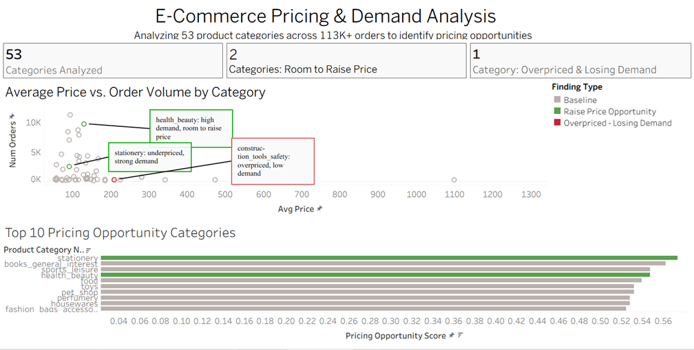

# E-Commerce Product Pricing & Demand Analysis

Analyzing pricing, ratings, and sales-volume data for 500+ products across 53 categories using SQL and Python, to identify where pricing changes could improve revenue without hurting demand.

## 📊 Dashboard

[View Live Interactive Dashboard on Tableau Public](https://public.tableau.com/app/profile/manashri.s/viz/ecommerce-pricing-dashboard/Dashboard1)

## 🔍 Key Findings
- **`stationery` and `health_beauty`** show strong order volume and solid review scores (4.0+) at relatively low average prices — indicating room to test price increases without hurting demand.
- **`construction_tools_safety`** shows a high average price paired with very low order volume (194–265 orders, vs. 2,000–9,700+ for top-performing categories) — a strong candidate for a price cut or bundled promotion.
- Review scores across all 53 categories were fairly consistent (4.1–4.45), meaning **price and demand patterns matter more than review-score differences** when deciding where to test pricing changes.

## 📈 Recommendation
Run a controlled price-increase test on `stationery` and `health_beauty`, and test a promotional discount or bundling strategy on `construction_tools_safety` to lift order volume. Full reasoning in [`recommendation_memo.md`](recommendation_memo.md.txt).

## 🛠️ Tech Stack
- **SQL** — category-level aggregation, pricing opportunity scoring
- **Python (pandas)** — data cleaning and transformation
- **Tableau** — interactive dashboard and visualization

## 📁 Project Structure
ecommerce-pricing-analysis/
├── data/ # Raw and cleaned datasets
├── python/ # Data cleaning & analysis scripts
├── sql/ # SQL queries
├── dashboard/ # Tableau workbook
├── screenshots/ # Dashboard preview image
├── recommendation_memo.md.txt # Written findings & recommendation
└── README.md

## 📌 Data Source
[Olist Brazilian E-Commerce Public Dataset](https://www.kaggle.com/datasets/olistbr/brazilian-ecommerce) (Kaggle, public domain) — 113,314 order-item records across 53 product categories.
